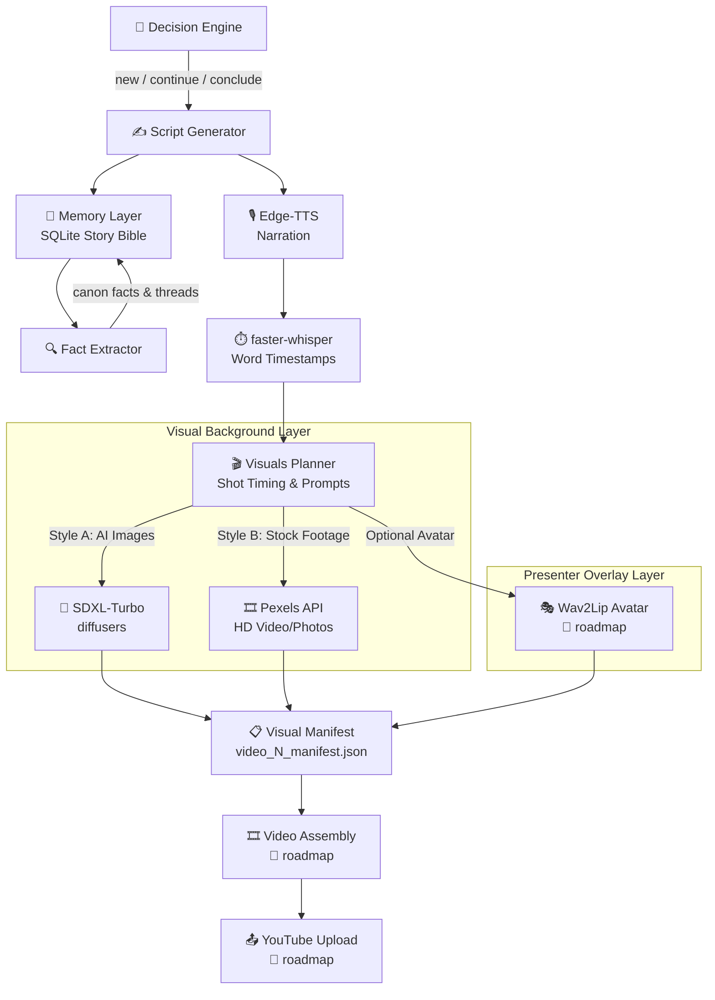

<div align="center">

# 🎬 YT Automation

**An autonomous pipeline for generating YouTube Shorts & long-form videos —**
**from story-bible memory to voice synthesis, captions, AI visuals, and stock B-roll.**


[Overview](#-overview) · [Pipeline](#-how-it-works) · [Quick Start](#-quick-start) · [Modules](#-module-map) · [Roadmap](#-roadmap)

</div>

---

## 🌟 Overview

YT Automation runs continuous, structured content-generation loops with minimal manual intervention. It doesn't just write scripts — it **remembers**. A persistent SQLite "story bible" tracks series, characters, canon facts, and unresolved plot threads, so multi-part narratives stay consistent across videos.

| Capability | What it does |
|---|---|
| 🧠 **Story Bible Memory** | Tracks series, canon facts, character sheets & unresolved threads in SQLite |
| 🧭 **Decision Engine** | Decides *new video* vs *continue series* vs *conclude series* from cadence & staleness rules |
| ✍️ **Script Generation** | LLM-written retention-optimized scripts: hook → scenes → ending → CTA |
| 🔍 **Fact Extraction** | Parses each new script back into the story bible to enforce continuity |
| 🎙️ **Voice Synthesis** | Free, key-less narration via Edge-TTS |
| ⏱️ **Word-Level Captions** | Local `faster-whisper` timestamps mapped back to script segments |
| 🎨 **Style A (AI Visuals)** | Local `SDXL-Turbo` image generation via `diffusers` on CUDA GPU |
| 🎞️ **Style B (Stock B-Roll)** | Automated HD stock video/photo retrieval via Pexels API |
| 🎭 **Presenter Overlay** | Reserved overlay slot for Wav2Lip avatar presenter over Style A/B media |

---

## 🔄 How It Works



One run of the orchestrator = one video: **decide → script → extract facts → save**. Later stages pick up videos in `scripted` status to generate audio (`voiced`), and then generate synchronized visual assets (`visualized`).

---

## 🚀 Quick Start

### 1️⃣ Set up the environment

```bash
git clone https://github.com/1919-14/YT-Automation.git
cd YT-Automation

python -m venv venv
# Windows PowerShell:
.\venv\Scripts\activate
# Linux/macOS:
source venv/bin/activate

pip install -r requirements.txt
```

### 2️⃣ Configure credentials

```bash
cp .env.example .env
```

```env
LLM_PROVIDER=opencode_zen
LLM_BASE_URL=https://opencode.zen/v1
LLM_API_KEY=your_api_key_here
LLM_MODEL=deepseek-v3

PEXELS_API_KEY=your_pexels_key_here

WHISPER_MODEL_SIZE=small
WHISPER_DEVICE=cpu
```

### 3️⃣ Run the Master Pipeline (1-Click Video Creation & Publishing)

```bash
# Generate a new video, render 1080x1920 Shorts, create thumbnail, and publish as public to YouTube:
python -m scripts.orchestrator

# Generate full video & thumbnail locally without auto-uploading to YouTube:
python -m scripts.orchestrator --no-upload

# Generate for a specific existing video ID:
python -m scripts.orchestrator --video 1
```

---

## 🗺️ Module Map

| Module | Role |
|---|---|
| [scripts/orchestrator.py](scripts/orchestrator.py) | Master End-to-End pipeline orchestrator |
| [scripts/decision_engine.py](scripts/decision_engine.py) | New vs continue vs conclude series decision engine |
| [scripts/script_generator.py](scripts/script_generator.py) | LLM script prompts & story parsing |
| [scripts/fact_extractor.py](scripts/fact_extractor.py) | Canon facts → story bible extractor |
| [scripts/memory.py](scripts/memory.py) | SQLite state management layer |
| [scripts/llm_client.py](scripts/llm_client.py) | LLM API wrapper (OpenAI / Gemini / DeepSeek) |
| [scripts/categories.py](scripts/categories.py) | Content categories & format rules |
| [scripts/config.py](scripts/config.py) | `.env` configuration & VRAM release helper |
| [scripts/tts.py](scripts/tts.py) | Edge-TTS audio generation |
| [scripts/captions.py](scripts/captions.py) | Whisper transcription & word-level timestamp mapping |
| [scripts/voice_stage.py](scripts/voice_stage.py) | TTS + captions runner for pending videos |
| [scripts/visuals_planner.py](scripts/visuals_planner.py) | Shot timing breakdown & prompt formulation |
| [scripts/sdxl_generator.py](scripts/sdxl_generator.py) | SDXL-Turbo AI image generator (`diffusers` on CUDA) |
| [scripts/pexels_client.py](scripts/pexels_client.py) | Pexels API stock video & photo retriever |
| [scripts/visuals_stage.py](scripts/visuals_stage.py) | Visuals stage runner & manifest writer |
| [scripts/sadtalker_setup.py](scripts/sadtalker_setup.py) | SadTalker repo, dependencies, & checkpoint setup helper |
| [scripts/avatar_generator.py](scripts/avatar_generator.py) | Expressive avatar generator (SadTalker audio-driven portrait) |
| [scripts/avatar_stage.py](scripts/avatar_stage.py) | Avatar stage runner & manifest patcher |
| [scripts/video_composer.py](scripts/video_composer.py) | Video compositor (1080x1920 background + 420x420 circular avatar + karaoke subtitles) |
| [scripts/composite_stage.py](scripts/composite_stage.py) | Video compositing stage runner |
| [scripts/thumbnail_generator.py](scripts/thumbnail_generator.py) | High-CTR thumbnail generator (SDXL background + PIL bold typography) |
| [scripts/thumbnail_stage.py](scripts/thumbnail_stage.py) | Thumbnail stage runner & DB patcher |
| [scripts/metadata_optimizer.py](scripts/metadata_optimizer.py) | LLM YouTube algorithm metadata generator (Title, SEO Description, Hashtags, Tags) |
| [scripts/youtube_uploader.py](scripts/youtube_uploader.py) | YouTube Data API v3 OAuth2 uploader & thumbnail manager |
| [scripts/upload_stage.py](scripts/upload_stage.py) | Upload stage runner & SQLite state updater |

---

## 🏗️ Project Structure

```
YT Automation/
├── 📁 assets/            # audio/ · images/ · video/ · visuals/  (generated media & manifests)
├── 📁 data/              # schema.sql + memory.db + client_secret.json (OAuth secret)
├── 📁 logs/              # execution logs
├── 📁 output/            # final rendered videos (1080x1920 Shorts)
├── 📁 scripts/           # pipeline modules (see Module Map)
├── ⚙️ .env.example       # environment template
├── 📦 requirements.txt   # core dependencies
└── 📘 SETUP.md           # detailed setup & verification guide
```

---

## ⚙️ GPU Acceleration & Memory Management Note

> - **faster-whisper & SDXL-Turbo on CUDA:** `captions.py` and `sdxl_generator.py` leverage local GPU acceleration.
> - **VRAM Release (`config.cleanup_vram()`):** Neural network models are explicitly unloaded from VRAM after each stage so memory returns to ~0 MB for the next phase.
> - **Auto Storage Cleanup:** Intermediate asset files (bg images, temp audio, sub-clips) are automatically deleted after YouTube upload to prevent filling laptop storage.

---

## 🗺️ Roadmap

- [x] SQLite schema & memory layer
- [x] Config loader & LLM client
- [x] Decision engine
- [x] Script generator & fact extractor
- [x] Orchestrator (decision → script → DB)
- [x] Edge-TTS voice synthesis
- [x] faster-whisper word-level captions
- [x] Visual pipeline A — SDXL-Turbo AI images
- [x] Visual pipeline B — Pexels HD stock footage & photos
- [x] Visual presenter overlay — Expressive SadTalker avatar layer
- [x] Video compositing (1080x1920 timeline + 420x420 circular avatar + yellow karaoke subtitles)
- [x] Thumbnail generation (SDXL dedicated background art + PIL text hook overlay)
- [x] LLM YouTube algorithm metadata generator (Title, Description, Hashtags, Tags)
- [x] YouTube Auto-Upload & Thumbnail Publishing (Data API v3)
- [x] Master 1-Click Pipeline Orchestrator with VRAM release & auto storage cleanup

---

## 🛠️ Development & Testing

See [SETUP.md](SETUP.md) for step-by-step verification commands for each module.

---

## 📜 License

MIT License.
